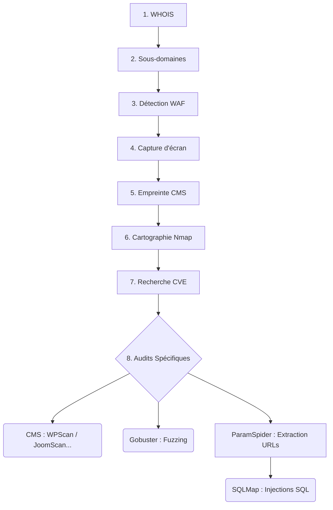
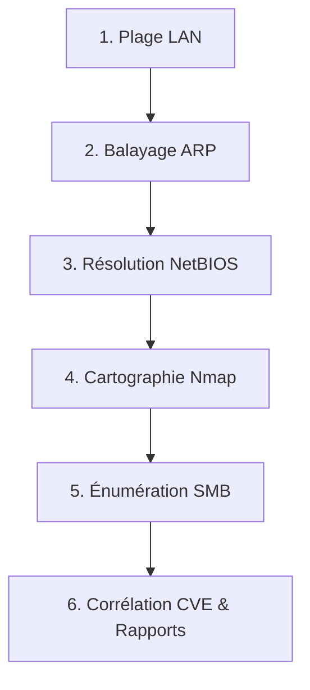

# 🟢 M-SCAN — Plateforme d'audit réseau, de sécurité web, de CVE et de génération de rapports

> **Concepteur & Développeur** : **Ronan BOZOC**

**M-SCAN** est un tableau de bord web interactif, visuel et professionnel conçu par **Ronan BOZOC** pour les élèves ingénieurs, les professionnels de la cybersécurité et les experts en test d'intrusion.

Il permet de réaliser des **pentests web externes automatisés en 7 étapes** (WHOIS, sous-domaines, WAF, capture, empreinte CMS, Nmap, puis audit complet Gobuster / SQLMap / CMS-Scan), d'explorer des **réseaux locaux** (LAN, partages SMB, NetBIOS), de corréler des vulnérabilités réelles (CVE) via Exploit-DB, d'exporter des **rapports d'audit professionnels aux formats PDF et Word (.docx)**, et de **protéger son IP publique via le réseau Tor avec OnionHop 3.7.8**.

---

## ⚠️ Avertissement légal et éthique

**Règle d'or** : L'utilisation de ces outils doit se faire exclusivement sur des systèmes dont vous êtes propriétaire ou pour lesquels vous possédez une autorisation écrite explicite.

- 🇫🇷 **Cadre légal en France** : L'accès ou le maintien frauduleux dans un système de traitement automatisé de données est puni par l'article 323-1 et suivants du Code pénal.
- 🇨🇲 **Cadre légal au Cameroun** : Les infractions liées à la cybercriminalité sont encadrées par la loi n° 2010/012 du 21 décembre 2010 (art. 65) — accès non autorisé, interception illégale, atteinte à l'intégrité d'un réseau — punissables de 5 à 10 ans d'emprisonnement et/ou de 5 000 000 à 10 000 000 de francs CFA d'amende.

**Usage recommandé** : Environnements de TP isolés, machines virtuelles de laboratoire (*Metasploitable, VulnHub, TryHackMe*), ou missions de test d'intrusion dûment autorisées.

---

## 🚀 Fonctionnalités clés

### 📄 1. Génération & Exportation de rapports d'audit (PDF & Word .docx)
- **PDF (`reportlab`)** : rapport complet avec en-tête professionnel, résumé exécutif, matrice de risque, ports/services et CVE.
- **Word (.docx) (`python-docx`)** : document `.docx` entièrement modifiable, prêt pour un livrable de pentest.
- **Accès 1-clic** : téléchargeable depuis les résultats ou l'historique.

### 🧅 2. Protection de l'IP publique & Intégration OnionHop (Réseau Tor)
- **Masquage d'IP** : au lancement via `./run.sh`, OnionHop 3.7.8 fait transiter les requêtes via Tor.
- **Installation automatique** : si absent, `./run.sh` télécharge l'AppImage depuis GitHub (`center2055/OnionHop`).
- **Moniteur d'IP en temps réel** : affiche l'IP du nœud de sortie Tor dans la barre latérale avec copie en 1 clic.

### 💻 3. Interface de lancement ASCII Art & Cyberpunk
- **Terminal Matrix vert** : menu interactif avec minuteur de démarrage automatique (15 s).
- **Ports dynamiques** : sélection automatique d'un port libre ≥ 10 001 si le port 5000 est occupé.

### 📊 4. Télémétrie système en direct
- Affichage horloge, % CPU, % RAM et débit réseau avec graphique Sparkline Canvas.

---

## 🛠️ 24 outils de sécurité — par catégorie

M-SCAN intègre **24 outils et modules** vérifiés automatiquement au démarrage, classés par rubrique thématique :

### 🔍 Reconnaissance & OSINT
| # | Outil | Rôle |
|---|-------|------|
| 1 | `searchsploit` (exploitdb) | Recherche d'exploits CVE dans la base locale Exploit-DB |
| 2 | `subfinder` | Découverte rapide multi-sources de sous-domaines (CT Logs, SecurityTrails) |
| 3 | `sublist3r` | Énumération passive OSINT de sous-domaines via moteurs de recherche |
| 4 | `whois` | Consultation des registres de noms de domaine (WHOIS) |

### 🌐 Scans Réseau & Exploration LAN
| # | Outil | Rôle |
|---|-------|------|
| 5 | `enum4linux` | Énumération complète des utilisateurs, groupes et partages Windows/Samba |
| 6 | `nbtscan` | Résolution NetBIOS et identification des groupes de travail |
| 7 | `netdiscover` | Découverte d'hôtes actifs par ARP (couche 2, passe les firewalls ICMP) |
| 8 | `nmap` | Scanner de ports, services, OS et vulnérabilités réseau |
| 9 | `smbmap` | Audit des autorisations d'accès aux partages SMB (READ/WRITE/NO ACCESS) |

### 🕵️ Empreinte & Analyse Web
| # | Outil | Rôle |
|---|-------|------|
| 10 | `gowitness` | Capture d'écran automatisée d'applications web (headless) |
| 11 | `nuclei` | Scanner de vulnérabilités basé sur des templates réseau et web |
| 12 | `wafw00f` | Détection de pare-feux applicatifs web (WAF) |
| 13 | `whatweb` | Empreinte technologique web (CMS, serveurs, frameworks, PHP) |

### 🔐 Audit Web & CMS Spécifiques
| # | Outil | Rôle |
|---|-------|------|
| 14 | `droopescan` | Scanner de vulnérabilités pour les CMS Drupal et SilverStripe |
| 15 | `gobuster` | Fuzzing de répertoires et fichiers cachés (wordlists Kali) |
| 16 | `joomscan` | Scanner de vulnérabilités pour le CMS Joomla |
| 17 | `moodlescan` | Audit de sécurité spécialisé des plateformes Moodle |

| 19 | `wpscan` | Scanner de failles spécifique WordPress (plugins, thèmes, utilisateurs) |

### 💉 Reconnaissance & OSINT Avancé
| # | Outil | Rôle |
|---|-------|------|
| 20 | `paramspider` | Extraction d'URLs avec paramètres via archives web (Wayback Machine) pour alimenter SQLMap |

### 💉 Audit & Injections Bases de Données
| # | Outil | Rôle |
|---|-------|------|
| 21 | `nosqlmap` | Audit d'injection et de sécurité pour bases de données NoSQL |
| 22 | `sqlmap` | Détection et exploitation automatique des injections SQL |

### 📊 Rendus Visuels, Rapports & Télémétrie
| # | Outil | Rôle |
|---|-------|------|
| 23 | `psutil` | Télémétrie CPU, RAM et réseau en temps réel |
| 24 | `python-docx` | Génération et exportation de rapports Word (.docx) |
| 25 | `reportlab` | Génération et exportation de rapports PDF professionnels |

### 🔎 Vérification automatique et installation en un clic

Au chargement, le backend vérifie la présence des **25 outils** sur le système hôte, classe les résultats par rubrique dans le tableau de bord, et propose :
- Un **bandeau d'alerte** listant les paquets manquants.
- Un bouton **"Installer les outils manquants"** qui appelle `pkexec` (Polkit) pour installer via `apt-get` / `pip` sans avoir besoin de lancer Flask en root.
- Pour les outils non disponibles en dépôt (`droopescan`, `moodlescan`, `nosqlmap`), une **installation automatique depuis leur dépôt GitHub officiel**.

---

## ⚡ Workflows détaillés

### 🌐 1. Workflow du scan web distant (`/web`) — 7 étapes

Ce workflow réalise un **pentest externe complet** avec un **Aiguillage Conditionnel Intelligent (*Smart Branching*)** basé sur le CMS détecté :



| Étape | Outils | Rôle |
| :--- | :--- | :--- |
| **1 — WHOIS** | `whois` | Registrar, serveurs DNS (NS), dates, DNSSEC — information passive sans contact avec la cible. |
| **2 — Sous-domaines** | `Subfinder` + `Sublist3r` + DNS Probe | Énumération hybride : CT Logs, OSINT moteurs de recherche, sondage DNS multithreadé avec **filtre anti-Wildcard DNS** (élimination des faux positifs `*.domaine.com`). |
| **3 — WAF** | `Wafw00f` | Détection du pare-feu applicatif (Cloudflare, ModSecurity, AWS WAF, Imperva). Placé **avant** les scans actifs pour anticiper les blocages. |
| **4 — Capture** | `Gowitness` | Rendu visuel headless de la page d'accueil de la cible (JPEG intégré au rapport). |
| **5 — Empreinte CMS** | `WhatWeb` | Détection de la pile logicielle (WordPress, Joomla, Drupal, Moodle, Nginx, Apache, PHP, en-têtes HTTP). Retourne le **type de CMS** pour le Smart Branching de l'étape 8. |
| **6 — Nmap** | `Nmap` + `Nuclei` | Cartographie ports/services, exécution de templates vulnérabilités. Fallback automatique `-sT` si `-sS` refusé (sans root). |
| **7 — Recherche CVE** | `Searchsploit` (Exploit-DB) | Recherche hors-ligne ou via API de vulnérabilités et d'exploits connus pour chaque service et version détectés à l'étape 6. |
| **8 — Audit complet** | `Gobuster` + `ParamSpider` + `SQLMap` + CMS Scanner | **Smart Branching** : WPScan si WordPress, JoomScan si Joomla, Droopescan si Drupal, Moodlescan si Moodle. En parallèle : Gobuster (fuzzing de répertoires). ParamSpider récupère d'abord toutes les URLs avec paramètres vulnérables dans les archives web, puis les envoie en masse à SQLMap pour maximiser la surface d'attaque d'injections SQL. |
| **Livrables** | `ReportLab` + `python-docx` | Rapport PDF & Word avec score de risque global, export 1 clic. |

---

### 🏠 2. Workflow du scan réseau local (`/local`)



| Étape | Outils | Rôle |
| :--- | :--- | :--- |
| **1 — Interface LAN** | Détection auto | Identifie l'interface réseau active et calcule la plage du sous-réseau (ex. `192.168.1.0/24`). |
| **2 — ARP** | `Netdiscover` | Découverte d'hôtes par paquets ARP (couche 2 — détecte même si ICMP bloqué par Windows Defender). |
| **3 — NetBIOS** | `nbtscan` + mDNS | Identifie le nom de machine, groupe de travail et OUI MAC. |
| **4 — Nmap** | `Nmap` (`-sS`/`-sT`/`-sV`/`-O`) | Ports ouverts, bannières de services, détection OS. |
| **5 — SMB** | `enum4linux` + `smbmap` | Utilisateurs, groupes, politiques mots de passe, droits READ/WRITE sur partages Samba. |
| **6 — CVE & Rapports** | `Searchsploit` + `ReportLab` + `python-docx` | Croise les versions avec Exploit-DB, calcule le score de risque, génère PDF & Word. |

---

### ⚙️ 3. Workflow du scan manuel avancé

Configuration fine des options `nmap` :

**Types de scans :**
- **TCP SYN (`-sS`)** — furtif (half-open), nécessite `cap_net_raw`.
- **TCP Connect (`-sT`)** — connexion complète, sans privilèges root.
- **UDP (`-sU`)** — services UDP (DNS, DHCP, SNMP).
- **Scans furtifs (`-sF`, `-sN`, `-sX`)** — FIN, NULL, Xmas (RFC TCP).
- **TCP ACK (`-sA`)** — détecte les firewalls à état (stateful).

**Options d'évasion & timing :**
- Vitesse `-T0` à `-T5` (Paranoid → Insane).
- Fragmentation de paquets `-f` (contournement IDS).
- Leurres IP `-D RND:5`.
- Traceroute `--traceroute`.

---

### 📊 4. Historique, rapports & base SQLite (`scanner_history.db`)

Tous les scans (web, local, manuel, audit) sont enregistrés localement :
- Contexte complet (cible, type, horodatage, résultats JSON).
- Consultation, rechargement interactif, suppression et **export PDF/Word en 1 clic**.

---

## 🔒 Privilèges Linux & sécurité (`setcap`)

Les scans `-sS` (TCP SYN) et `-O` (détection OS) nécessitent les *raw sockets*. Plutôt que de lancer Flask en root, le script d'installation utilise les **Linux Capabilities** :

```bash
sudo setcap cap_net_raw,cap_net_admin+eip $(readlink -f venv/bin/python3)
```

Seul l'interpréteur Python du venv reçoit les privilèges stricts d'émission de paquets bruts.

---

## 🎓 Objectifs pédagogiques

M-SCAN est conçu pour transmettre les fondamentaux de la sécurité offensive et défensive :

1. **Liaison UI → CLI** : chaque option reconstruite et affichée en temps réel (`Command Preview`).
2. **Mécanique des paquets** : SYN vs TCP Connect vs FIN/NULL/Xmas, exigences de privilèges.
3. **Sécurité applicative web** : détecter un WAF, vérifier les en-têtes HTTP (HSTS, CSP, X-Frame-Options).
4. **Exploration LAN** : découverte ARP, NetBIOS, audit SMB.
5. **Gestion des vulnérabilités** : corrélation CVE Exploit-DB, génération de rapports PDF/Word.
6. **Smart Branching CMS** : comprendre pourquoi WPScan ≠ JoomScan ≠ Droopescan et comment l'outil choisit automatiquement le bon scanner.

---

## 🚀 Installation et lancement

### Méthode 1 : automatisée (recommandée)

```bash
# 1. Cloner et accéder au dossier
git clone https://github.com/Ronan-Bozoc-cyber/matrix-scanner.git
cd matrix-scanner

# 2. Rendre les scripts exécutables
chmod +x install.sh run.sh

# 3. Installation complète (venv, apt, pip, setcap)
./install.sh

# 4. Lancement avec interface ASCII Matrix
./run.sh
```

### Méthode 2 : manuelle

```bash
# 1. Environnement virtuel Python
python3 -m venv venv && source venv/bin/activate

# 2. Dépendances Python
pip install -r requirements.txt

# 3. Outils système Kali/Debian/Ubuntu
sudo apt-get update
sudo apt-get install -y nmap exploitdb whatweb wafw00f nuclei wpscan \
  gowitness netdiscover nbtscan enum4linux smbmap gobuster sqlmap \
  policykit-1 libcap2-bin curl

# 4. Outils depuis GitHub (non disponibles en apt)
pip install droopescan moodlescan nosqlmap 2>/dev/null || \
  git clone https://github.com/droope/droopescan tools_git/droopescan

# 5. Capacités réseau
sudo setcap cap_net_raw,cap_net_admin+eip $(readlink -f venv/bin/python3)

# 6. Lancement
python3 app.py
```

---

## 📁 Architecture du projet

```
matrix-scanner/
├── app.py                   # Backend Flask : routes API REST, audit (Gobuster/SQLMap/CMS), export PDF/DOCX, SQLite, CVE
├── install.sh               # Script d'installation automatisé (venv, apt-get, pip, setcap, outils Git)
├── run.sh                   # Lancement interactif (ASCII Art Matrix, OnionHop Tor, ports dynamiques)
├── requirements.txt         # Dépendances Python (Flask, reportlab, python-docx, requests, PySocks)
├── scanner_history.db       # Base SQLite générée automatiquement
├── README.md                # Documentation officielle
├── tools_git/               # Outils installés depuis GitHub (droopescan, moodlescan, nosqlmap)
├── templates/
│   ├── base.html            # Layout principal (barre latérale, moniteur IP, horloge, Canvas Matrix)
│   ├── home.html            # Accueil & vérification des 24 outils par rubrique
│   ├── web.html             # Interface pentest web — workflow 7 étapes
│   ├── local.html           # Interface reconnaissance LAN
│   ├── history.html         # Historique des scans & export PDF/DOCX
│   ├── settings.html        # État des dépendances et outils système
│   ├── reports.html         # Gestionnaire de rapports & éditeur d'audit
│   └── partials/
│       ├── results.html     # Cartes résultats : Gobuster, SQLMap, CMS Audit, Nmap, CVE
│       ├── modal.html       # Modales CVE / rapport d'audit
│       ├── manual_settings.html  # Formulaire options avancées Nmap
│       └── banners.html     # Bandeaux d'alerte dépendances
└── static/
    ├── style.css            # Thème sombre Matrix / Cyberpunk (Glassmorphism & animations)
    ├── script.js            # Logique frontend : workflow 7 étapes, audit Gobuster/SQLMap/CMS, Smart Branching, Chart.js
    └── matrix.js            # Animation Canvas pluie de code Matrix
```

---

## 🔑 Routes API principales

| Méthode | Route | Description |
|---------|-------|-------------|
| `POST` | `/api/scan` | Lancement d'un scan Nmap (local ou web) |
| `GET` | `/api/scan-status/<job_id>` | Polling statut scan Nmap |
| `POST` | `/api/whatweb-scan` | Empreinte CMS & technologies (WhatWeb) |
| `POST` | `/api/waf-scan` | Détection WAF (Wafw00f) |
| `POST` | `/api/whois-scan` | Requête WHOIS |
| `POST` | `/api/subdomains-scan` | Énumération sous-domaines (Subfinder + Sublist3r) |
| `POST` | `/api/screenshot` | Capture d'écran (Gowitness) |
| `POST` | `/api/wpscan` | Audit WordPress (WPScan) |
| `GET` | `/api/wpscan-status/<job_id>` | Polling statut WPScan |
| `POST` | **`/api/audit/gobuster`** | **Fuzzing de répertoires (Gobuster)** |
| `POST` | **`/api/audit/sqlmap`** | **Détection injections SQL (SQLMap)** |
| `POST` | **`/api/audit/cms-scan`** | **Scanner CMS (WPScan/JoomScan/Droopescan/Moodlescan)** |
| `GET` | **`/api/audit/status/<job_id>`** | **Polling statut de tous les jobs d'audit** |
| `POST` | `/api/nuclei-scan` | Scan Nuclei templates |
| `POST` | `/api/netdiscover-scan` | Découverte ARP LAN |
| `GET` | `/api/check-deps` | Vérification des 24 outils (avec catégories) |
| `POST` | `/api/install-deps` | Installation outils manquants (pkexec) |
| `GET` | `/api/system-stats` | Télémétrie CPU/RAM/Réseau |

---

## 🛠️ Guide de dépannage (FAQ)

| Symptôme | Cause probable | Solution |
|---|---|---|
| **Erreur "Permission refusée" (-sS / -O)** | `setcap` non attribué au venv | `sudo setcap cap_net_raw,cap_net_admin+eip venv/bin/python3` ou utiliser `-sT`. |
| **Bouton "Installer les outils" inactif** | `policykit-1` absent | `sudo apt-get install policykit-1` |
| **Erreur 500 sur `/api/install-deps`** | Clé `apt_package` manquante dans un outil | Vérifier la définition dans `REQUIRED_TOOLS` dans `app.py`. |
| **Erreur réseau JSON invalide** | `urlparse` non importé / serveur planté | Vérifier les imports en haut de `app.py` ; relancer le serveur. |
| **Nmap très lent (> 10 min)** | Cible derrière un pare-feu avec beaucoup de ports filtrés | Utiliser le mode `fast` ou réduire la plage de ports avec l'option manuelle. |
| **Audit — Gobuster ne se lance pas** | Outil non installé | Aller dans **Vérification Système** et cliquer **Installer les outils manquants**. |
| **Scanner CMS non déclenché** | CMS non reconnu par WhatWeb | Le Smart Branching n'active le scanner que pour WordPress, Joomla, Drupal et Moodle. |
| **Port 5000 déjà utilisé** | Autre service sur 5000 | `./run.sh` sélectionne automatiquement un port libre ≥ 10 001. |
| **Téléchargement OnionHop échoue** | Pas d'accès réseau ou `curl` absent | Vérifier connexion + `sudo apt-get install curl`. |
