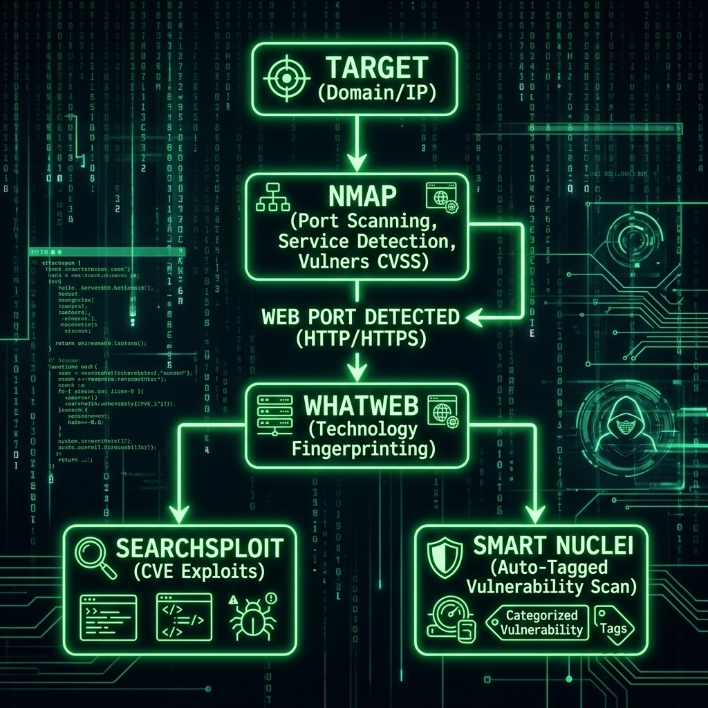

# 🟢 Matrix Scanner — Dashboard pédagogique de reconnaissance réseau, audit Web & CVE

**Matrix Scanner** est une application web locale moderne et pédagogique destinée aux élèves ingénieurs et passionnés de cybersécurité. Elle permet d'apprendre, de manière visuelle, interactive et guidée, l'utilisation de `nmap`, l'audit de sécurité d'applications web, ainsi que la recherche de vulnérabilités connues (CVE) via la base locale `searchsploit` (Exploit-DB).



---

## ⚠️ AVERTISSEMENT LÉGAL

**N'utilisez cet outil que sur des machines que vous possédez ou pour lesquelles vous disposez d'une autorisation écrite explicite** (VM de lab type Metasploitable, réseau de TP isolé, environnement CTF...). Scanner un système tiers sans autorisation est une infraction pénale (en France : art. 323-1 du Code pénal).

---

## 🌟 Fonctionnalités principales

### 🤖 Mode Autopilote & Scan Intelligent (`/web` & `/local`)
- **Analyse automatique d'IP/Domaine** : Test de connectivité ICMP / Ping préalable.
- **Scan Réseau Nmap** : Détection des ports ouverts, résolution de services/versions (`-sV`) et empreinte d'OS (`-O`).
- **Audit de Sécurité Web** : Détection d'en-têtes HTTP de sécurité (HSTS, CSP, X-Frame-Options, X-Content-Type-Options, etc.), détection de serveurs et technologies via `whatweb`.
- **Captures d'écran Web** : Génération automatique de visuels des services web découverts.
- **Corrélation CVE automatique** : Interrogation automatique de la base locale Exploit-DB via `searchsploit` pour chaque service identifié.
- **Score de Risque & Recommandations** : Calcul d'un score de vulnérabilité global (0 à 100) accompagné de conseils de remédiation clairs.

### ⚙️ Mode Scan Manuel Avancé
- **7 Types de Scans Nmap** : SYN Scan (`-sS`), TCP Connect (`-sT`), UDP Scan (`-sU`), FIN (`-sF`), NULL (`-sN`), Xmas (`-sX`), ACK (`-sA`).
- **Portée personnalisable** : Top 100, Top 1000, Ports Web, Tous les ports (65535) ou sélection sur mesure.
- **Techniques d'évasion & Timing** : Fragmentation de paquets (`-f`), leurres IP (`-D RND:5`), contrôle de cadence (`-T0` à `-T5`), traceroute (`--traceroute`), et scripts NSE.
- **Aperçu dynamique (`Command Preview`)** : Affichage en temps réel de la commande `nmap` exacte construite sous le capot pour renforcer l'apprentissage CLI.

### 📊 Visualisation & Historique SQLite
- **Dashboard Réorganisé & Responsive** : Interface fluide en thématique Cyberpunk / Matrix avec fond animé en pluie de code Canvas (`matrix.js`).
- **Graphiques interactifs Chart.js** : Répartition visuelle des services et classification des niveaux de sévérité des vulnérabilités.
- **Base de données SQLite (`scanner_history.db`)** : Historique complet des scans enregistrés, comparaison, consultation des rapports passés et suppression en un clic.

### 🛠️ Gestionnaire de Dépendances & Polkit
- Détection automatique au démarrage des outils indispensables (`nmap`, `searchsploit` / `exploitdb`, `whatweb`, `policykit-1`).
- Bouton d'installation graphique en un clic avec élévation de privilèges Polkit (`pkexec`).

---

## 📋 Prérequis système

- **Système d'exploitation** : Linux (Debian, Ubuntu, Kali Linux)
- **Python** : Version 3.9+
- **Privilèges** : `policykit-1` (fournit `pkexec`, généralement présent sur les environnements de bureau)
- **Accès internet / apt** : Pour l'installation automatique des paquets système (`nmap`, `exploitdb`, `whatweb`)

---

## 🚀 Installation & Lancement

### 1. Installation automatisée (recommandée)

Un script `install.sh` automatise l'intégralité de la procédure (création du venv Python, installation de Flask, paquets système via `apt`, et attribution des capacités réseau nécessaires aux scans `-sS`/`-O` sans executer le serveur en root) :

```bash
cd matrix-scanner
chmod +x install.sh run.sh
./install.sh      # Demande le mot de passe sudo UNIQUEMENT pour apt et setcap
./run.sh           # Lance le serveur Flask (jamais avec sudo)
```

### 2. Lancement du serveur

```bash
./run.sh
# ou manuellement :
source venv/bin/activate && python3 app.py
```

Le serveur démarre sur **`http://127.0.0.1:5000`** (accessible uniquement depuis la machine locale). Ouvrez cette adresse dans votre navigateur web.

---

## 🔒 Droits Root & Capacités réseau (`setcap`)

Les scans **SYN (`-sS`)** et la **détection d'OS (`-O`)** de `nmap` nécessitent la construction de paquets réseau bruts (*raw sockets*). 

Pour des raisons de sécurité, le serveur Flask **ne doit jamais être exécuté en root**. Deux options sont proposées :

1. **Attribution automatique des capacités Linux (`setcap`)** (géré par `install.sh`) :
   ```bash
   sudo setcap cap_net_raw,cap_net_admin+eip $(readlink -f venv/bin/python3)
   ```
   L'interpréteur Python du venv reçoit uniquement les privilèges réseau nécessaires.
2. **Utilisation du scan TCP Connect (`-sT`)** :
   Fonctionne sans aucun privilège spécifique et est directement sélectionnable dans le mode manuel de l'interface.

---

## 📁 Structure du projet

```
matrix-scanner/
├── app.py                 # Backend Flask : routes API, orchestration Nmap, WAF/HTTP, SQLite, CVE
├── install.sh             # Script d'installation automatisée (venv, apt, setcap)
├── run.sh                 # Script d'exécution du serveur
├── requirements.txt       # Dépendances Python (Flask)
├── scanner_history.db     # Base de données SQLite (générée automatiquement à la première exécution)
├── README.md              # Documentation du projet
├── templates/             # Templates HTML Jinja2 modularisés
│   ├── base.html          # Layout principal (barre de navigation, canvas Matrix, scripts communs)
│   ├── home.html          # Vue d'ensemble & tableau de bord principal
│   ├── web.html           # Section d'audit & scanner Web
│   ├── local.html         # Section de reconnaissance réseau local / LAN
│   ├── history.html       # Consultation & gestion de l'historique des scans
│   ├── settings.html      # État des outils système et configuration
│   └── partials/          # Composants UI réutilisables
│       ├── results.html   # Rendu dynamique des résultats de scan & graphiques Chart.js
│       ├── modal.html     # Modales interactives pour la recherche et le détail des CVE
│       ├── manual_settings.html # Formulaire d'options manuelles Nmap
│       └── banners.html   # Bannière et indicateurs d'état des dépendances
└── static/
    ├── style.css          # Feuille de style principale (Thème sombre Matrix, Cyberpunk, responsive)
    ├── script.js          # Logique frontend (appels API asynchrones, Chart.js, modales CVE)
    └── matrix.js          # Animation Canvas effet pluie de code Matrix
```

---

## 🎓 Démarche pédagogique

- **Encarts explicatifs** : Chaque option graphique (types de scan, ports, timing, évasion) est assortie d'une note didactique expliquant les flags `nmap` sous-jacents.
- **Commande en temps réel** : La commande CLI exacte est affichée au fur et à mesure des choix pour familiariser les étudiants avec le terminal.
- **Parsing XML natif** : Les résultats bruts de `nmap` sont traités via le format XML (`-oX -`) et structurés sous forme de tableaux lisibles.
- **Sensibilisation aux vulnérabilités** : Pour chaque service découvert avec sa version précise (`-sV`), le bouton **"🔍 Chercher CVE"** interroge la base Exploit-DB locale (`searchsploit --json`) pour lier la théorie à la pratique.

---

## 🛠️ Guide de dépannage

| Symptôme | Cause probable | Solution |
|---|---|---|
| Le bouton d'installation ne réagit pas | `policykit-1` non installé | Exécuter `sudo apt-get install policykit-1` puis relancer |
| Erreur "Permission refusée" lors du scan | Scan `-sS` ou `-O` sans privilèges | Relancer `./install.sh` pour réappliquer `setcap`, ou choisir le scan `-sT` |
| Pop-up Polkit annulée | Annulation manuelle du mot de passe | Cliquer à nouveau sur le bouton d'installation et saisir le mot de passe sudo |
| Le scan ne termine pas | Cible injoignable ou bloquée par un pare-feu | Tester la réactivité avec un ping, réduire le nombre de ports ou changer le timing (`-T3`) |
